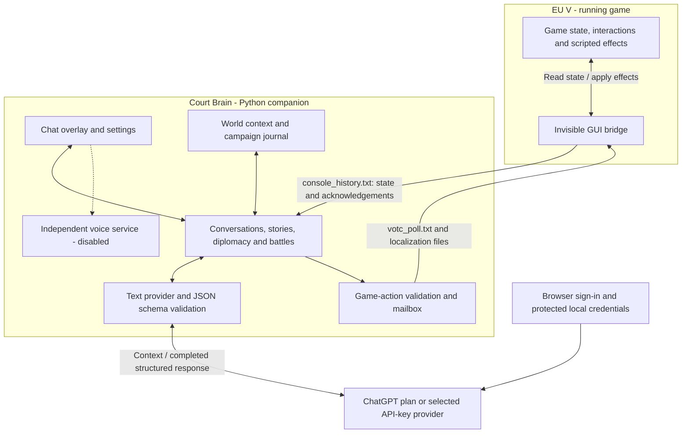

# Whispers in the Court - Europa Universalis V

Talk with your court, summon the council, send envoys and shape stories whose
consequences reach the game. This fork connects **Court Brain** to an eligible
**ChatGPT plan** through browser sign-in. Gemini, Mistral and OpenRouter remain
available with your own API key.

Built for **EU5 1.3.11**, Windows and single-player. Inspired by the CK3 mod
*Voices of the Court*.

## Architecture at a glance

The model proposes dialogue and structured outcomes. Python validates responses
and supported actions before constructing game effects. The game and companion
exchange files; the AI does not execute code or control the game directly.
Model inference runs online, while Court Brain and campaign memory live locally.

## Getting started

1. Download this fork's `WhispersInTheCourt.exe` from a release that includes
   ChatGPT support, or build/run the current source using the
   [developer guide](docs/DEVELOPING.md). Older release files do not acquire new
   features when the README changes.
2. Start Court Brain and choose your language, event frequency and difficulty.
   In **The AI**, select **ChatGPT plan** and **Continue with ChatGPT**. Complete
   sign-in and plan-usage consent in your browser.
3. Select **Refresh models / retry connection**, choose an available model,
   then save the settings. Eligibility, models and usage depend on your account
   and workspace. There is no API-key or automatic paid-provider fallback.
4. Use **Start EU5** and complete any Steam sign-in or launch prompt. In the game's
   mod manager enable **Whispers in the Court (USE THIS)**
   and disable duplicate Workshop/manual copies. Court Brain installs the mod
   from the source bundled with the executable.
5. Load a game and keep Court Brain open. The record should say
   **The game answers: the bridge works.** Use **Speak with**, **Court**, the
   diplomacy interactions or **AI Advisor** to begin.

EU5 must run with `-debug_mode` (the launch button passes it through Steam), which disables
achievements. Use windowed or borderless fullscreen so the panel can appear.
The executable is not code-signed; release checksums and source/build information
are documented in [SECURITY.md](SECURITY.md).

## AI and voice

- **ChatGPT:** browser sign-in uses OpenAI's documented local/open-source
  [ChatGPT plan flow](https://developers.openai.com/siwc/token-sharing-open-source).
  This does not provide access to your ChatGPT chat history. Prompts include
  relevant game state, character context, campaign memory and your messages.
- **API-key providers:** select Gemini, Mistral or OpenRouter in **The AI**,
  enter your own key and model, then save. Limits, billing and data policies are
  those of the selected service. Invalid model names are reported, not replaced.
- **Voice:** disabled in this release. Type your ruler's words. Speech input and
  output have their own interface so a future optional backend can be added
  without changing the text provider. ChatGPT subscription voice is not included.
- **Usage:** a scene may require several model calls. Court Brain records model,
  tokens, request type, attempts and duration in `ai_usage.jsonl`; these counts
  do not represent money or remaining subscription allowance. Check **ChatGPT
  usage** for your account's limits.

## Features and guides

Conversations, council meetings, diplomacy, decrees, court characters, stories,
chronicles, memory and battle command are explained in the
[gameplay guide](docs/GAMEPLAY.md). The detailed descriptions were moved there
to keep installation and troubleshooting easy to find.

- [Architecture](docs/ARCHITETTURA.md) - game bridge, controller and memory.
- [ChatGPT integration](docs/CHATGPT.md) - connection, credentials and diagnostics.
- [Development](docs/DEVELOPING.md) - source setup, tests and Windows builds.
- [Implementation plan](docs/CHATGPT_IMPLEMENTATION_PLAN.md) - scope and verification record.
- [Security and privacy](SECURITY.md), [contributing](CONTRIBUTING.md),
  [license](LICENSE) and [notices](NOTICE.md).

## Troubleshooting

| Symptom | Check |
|---|---|
| ChatGPT is disconnected | Open **The AI**, complete sign-in and consent, refresh models and save your selection. |
| Plan usage is limited | Check **ChatGPT usage**. When available again, use **Refresh models / retry connection**. No reset time is guessed. |
| Connection check passes, generation fails | The catalog check is not proof of model access. Check the returned error; try an available model that accepts structured outputs. |
| No game connection or event text | Enable the correct mod copy and restart EU5 with `-debug_mode`. |
| DLC verification fails after launching | Close EU5, keep Court Brain open, and start from Steam with `-debug_mode` in the game's Launch Options. Older companion builds launched `eu5.exe` directly. |
| Overlay does not appear | Use windowed or borderless fullscreen and keep Court Brain running. |
| Microphone is disabled | No speech backend is installed; typed play works independently. |

Executable settings live in `%LOCALAPPDATA%\WhispersInTheCourt`; source settings
live beside the Python package. ChatGPT credentials are stored separately under
the current user's app-data folder. Campaign memory and logs live in the game's
`court_brain` folder. A legacy configuration is backed up before migration.
